# NYCU_DL - Deep Learning, Fall 2024

Coursework of the deep learning class, plus a
final project on symbolic music generation.

### Quick View
| # | Folder | Topic | Backbone | Dataset |
|---|--------|-------|----------|---------|
| 0 | [CA0/](CA0/) | Class imbalance & per-class robustness | ResNet-18 | CIFAR-10 |
| 1 | [CA1/](CA1/) | Function upscaling & the role of activations | MLP | Synthetic band-limited signals |
| 2 | [CA2/](CA2/) | Reliability, calibration, dropout ensembles | VGG-16 | CIFAR-10 |
| 3 | [CA3/](CA3/) | Sequence models & padding dynamics | CNN / RNN / GRU / LSTM | IMDB |
| 4 | [CA4/](CA4/) | Contextual word embeddings | BERT | IMDB |
| — | [FinalProject/](FinalProject/) | Symbolic music generation | Bi-GRU | MIDI synthesised from stock prices |

---

## CA0 — Investigating ResNet-18 under Heterogeneous CIFAR-10

> *Spec: [`CA0/PDL_challenge0.pdf`](CA0/PDL_challenge0.pdf) · Code: [`CA0/Challenge 0.ipynb`](CA0/Challenge%200.ipynb)*

### Problem setting

CIFAR-10 is perfectly balanced by construction — 6,000 images per class. Real datasets are not.
The question is how the *per-class* behaviour of a CNN degrades when that balance is broken, and
whether a purely loss-side intervention can recover it.

### Method

A configurable loader takes a count vector **N** = [N₁, …, N₁₀] and materialises a CIFAR-10 subset
with exactly `Nₖ` examples of class `k`, split 80/20 into train and evaluation folds. The model is
`torchvision` ResNet-18 with the final FC replaced by a 10-way linear head, trained with Adam and
cross-entropy for 20 epochs.

Three regimes are compared:

1. **Balanced baseline** — **N** = [4000]×10, repeated over 10 random head initialisations.
2. **Controlled imbalance** — for each `k`, `N_k = 6000` and `N_j = 3777` for `j ≠ k`. Ten such
   datasets, ten initialisations each.
3. **Mitigation** — the same imbalanced datasets, but with
   `nn.CrossEntropyLoss(weight=class_weights)` where the weights come from
   `sklearn.utils.class_weight.compute_class_weight(class_weight='balanced', …)`.

### Results

<p align="center">
  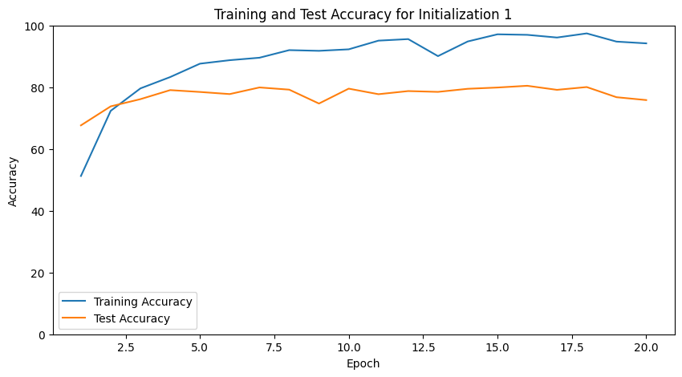<br>
  <em><b>Fig. 0.1</b> — Balanced baseline, one initialisation. Training accuracy climbs past 97%
  while evaluation accuracy saturates near 80%. The ~17-point gap that opens after epoch 5 is the
  overfitting signature the spec asks us to look for; the evaluation curve is flat, not
  decreasing, so the model memorises without actively degrading.</em>
</p>

<p align="center">
  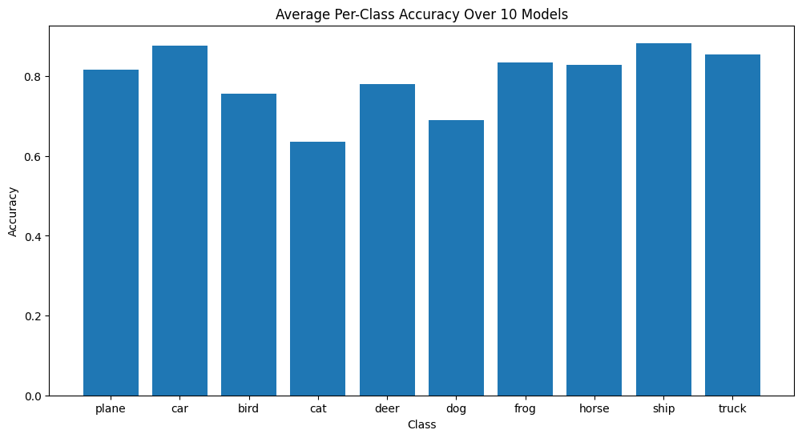<br>
  <em><b>Fig. 0.2</b> — Per-class score averaged over 10 trained models on the balanced dataset.
  Accuracy is <b>not</b> uniform even when the data is: <code>cat</code> (0.64) and
  <code>dog</code> (0.69) trail <code>ship</code> and <code>car</code> (~0.88) by more than 20
  points. The confusable animal classes are intrinsically harder, which sets the floor against
  which any imbalance effect must be measured.</em>
</p>

<p align="center">
  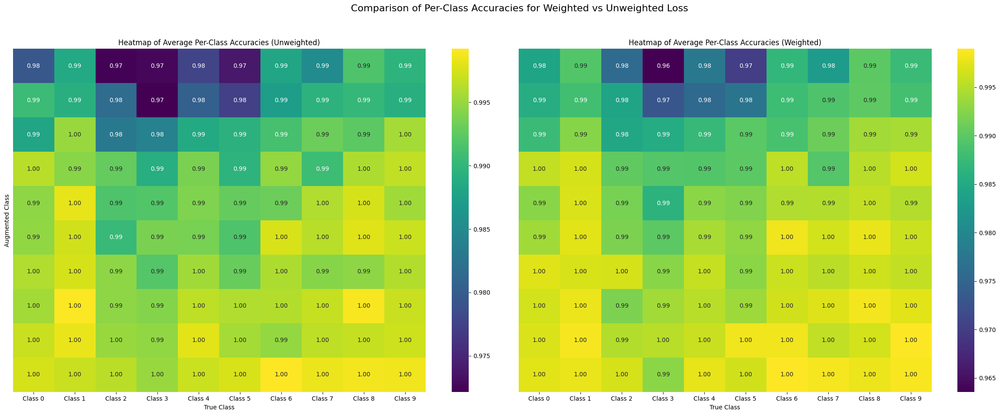<br>
  <em><b>Fig. 0.3</b> — The full simulation campaign. Row <code>i</code> is the dataset in which
  class <code>i</code> was over-represented (6000 vs 3777); column <code>j</code> is the evaluated
  class. Left: unweighted cross-entropy. Right: class-weighted cross-entropy. The
  weighted-loss panel is marginally flatter, but the two are close enough that the intervention
  cannot be called decisive at this imbalance ratio (1.59:1) — a genuinely mild skew compared to
  the long-tailed regimes where re-weighting is known to matter.</em>
</p>

### Caveats worth knowing before citing these numbers

These are real limitations of the implementation, recorded here rather than hidden:

- **The "test" fold is carved out of CIFAR-10's *training* split** via `random_split`, and it is
  re-drawn on every loader call. Across the repeated initialisations, examples the network already
  trained on leak into later evaluation folds. This is the most likely explanation for the 0.96–1.00
  band in Fig. 0.3 versus the ~0.80 in Fig. 0.1.
- **`reset_weights` only re-initialises `nn.Linear` layers.** The convolutional and BatchNorm
  weights carry over between runs, so the ten "independent initialisations" share a backbone that
  keeps accumulating training. They are better read as a warm-start sequence than as ten i.i.d. draws.
- **`evaluate_model` reports `precision_score(average=None)`**, which is per-class *precision*, not
  the per-class recall/accuracy the spec describes. Fig. 0.2 and Fig. 0.3 should be read as
  precision.

---

## CA1 — Neural Function Upscaling and the Role of Activations

> *Spec: [`CA1/PDL_challenge_1.pdf`](CA1/PDL_challenge_1.pdf) · Code: [`CA1/Challenge1.ipynb`](CA1/Challenge1.ipynb) (PyTorch)*

### Problem setting

Reconstructing a signal from samples is classically solved by sinc interpolation under
Nyquist–Shannon. This challenge asks what a DNN does with the same problem, and how the
architecture, the activation function, the amount of data and the sampling pattern shape the result.

Band-limited functions are synthesised in the frequency domain: draw 49 random complex Fourier
coefficients, impose Hermitian symmetry (`c₋ₖ = c̄ₖ`) so the inverse FFT is real-valued, and
transform to a length-512 discrete signal. A fixed scale factor gives the signals unit variance,
so every MSE below can be read as the fraction of signal energy that is not reproduced.

```python
coefficients            = np.zeros(512, dtype=np.complex128)
coefficients[1:50]      = np.random.randn(49) + 1j*np.random.randn(49)
coefficients[-49:]      = coefficients[1:50][::-1].conj()   # Hermitian symmetry
time_domain_function    = np.fft.ifft(coefficients).real
```

Every configuration is trained with Adam and MSE until early stopping, and repeated over 3 random
initialisations; figures report the mean (and standard deviation where shown).

### Task 1 — memorising a single function (10,000-neuron budget)

The network maps a scalar position `x` (rescaled to [-1, 1]) to the amplitude `y` of one fixed
function, trained on M of its 512 points. The quantity of interest is the **held-out MSE** on the
positions the network never saw, i.e. how it interpolates between training points. The target has
variance 0.60, so an MSE near 0.60 means the network outputs little more than a flat line.

<p align="center">
  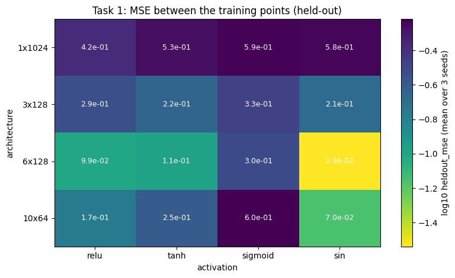<br>
  <em><b>Fig. 1.1</b> — Held-out MSE for four architectures and four activations (M = 128 regularly
  spaced points). Under a fixed neuron budget <b>depth matters more than width</b>: the 6x128
  network is the best architecture for every activation, while the single 1024-unit layer
  reaches 69–98% of the signal variance. The best configuration, 6x128 with sin, reproduces the
  function to within about 5% of its variance. Deep sigmoid networks (10x64) do not train at all.</em>
</p>

<p align="center">
  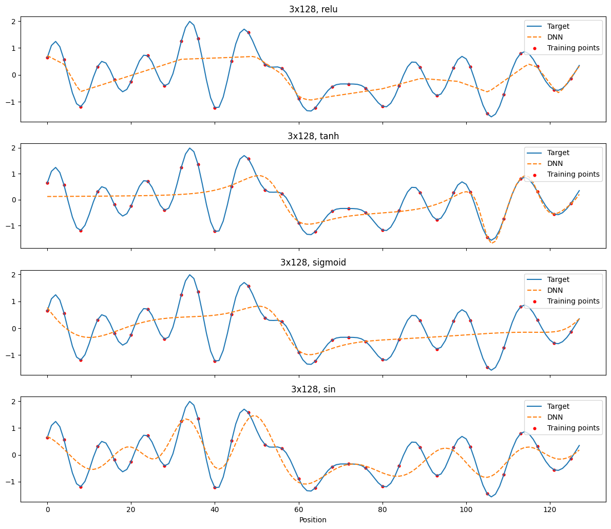<br>
  <em><b>Fig. 1.2</b> — The 3x128 network with each activation, zoomed on the first 128 positions.
  ReLU, tanh and sigmoid capture the slow variations but miss most of the fast oscillations, and
  do not even pass through all the training points: the difficulty is fitting high frequencies at
  all (spectral bias), not the shape of the interpolation between points. sin reproduces
  noticeably more of the oscillations.</em>
</p>

<p align="center">
  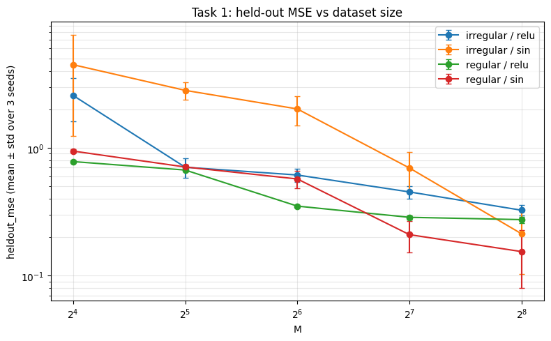<br>
  <em><b>Fig. 1.3</b> — Held-out MSE against the number of training points (3x128 network). With
  regular sampling and sin, the largest drop is between M = 64 and M = 128 (0.57 to 0.21), which
  brackets the Nyquist rate of about 2 × 49 = 98 samples; the transition is gradual rather than
  sharp because this network underfits. Irregular sampling is worse at every M, especially with
  few points.</em>
</p>

<p align="center">
  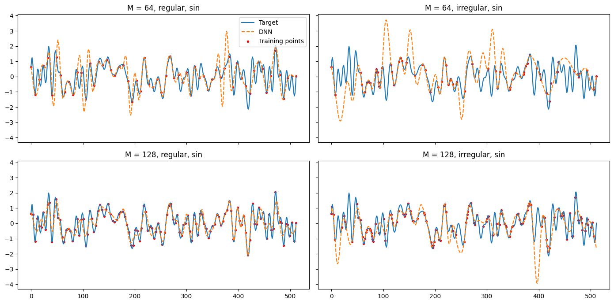<br>
  <em><b>Fig. 1.4</b> — Regular versus irregular training points with the sin activation. With
  regular points the reconstruction follows the target; with irregular points the periodic
  activation invents large oscillations inside the gaps, with amplitudes of 3 to 4 against a
  target that stays within about ±2.</em>
</p>

### Task 2 — interpolating the whole class of band-limited functions (1,000,000-neuron budget)

Now the network maps a 100-dimensional vector (one function sampled on a fixed index set 𝒳) to the
full 512-dimensional signal. Each training example is a *different* random function, and the model
is evaluated on 1,000 functions it has never seen, so it must learn the reconstruction operator
itself rather than any particular signal.

As a reference, when the band limit is known the problem is a linear least-squares fit of 98
coefficients to 100 samples. This classical method is exact with regular sampling (test MSE
1e-15), degrades with random sampling (4.8e-4) and breaks down with exponentially spaced samples
(2e7), because the least-squares problem becomes badly ill-conditioned.

<p align="center">
  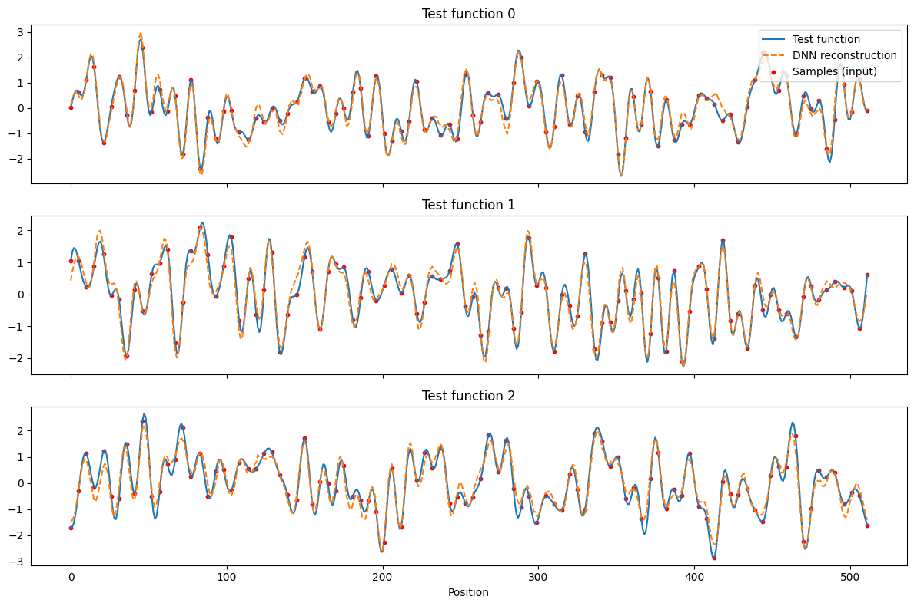<br>
  <em><b>Fig. 1.5</b> — Baseline (regular 𝒳, M = 2,000 training functions, 3x512 ReLU) on three
  unseen test functions. The test MSE is 0.049, about 5% of the signal variance: the network has
  learned a general reconstruction operator, with small errors mainly at the peaks.</em>
</p>

<p align="center">
  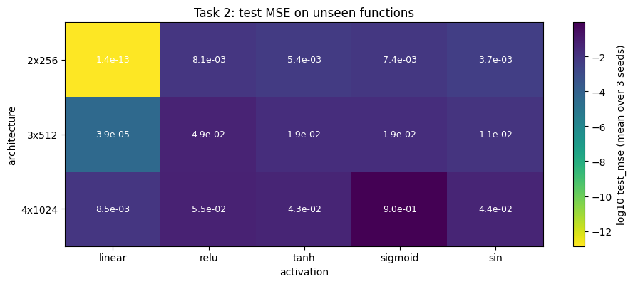<br>
  <em><b>Fig. 1.6</b> — Test MSE for three architectures and five activations (regular 𝒳,
  M = 2,000). Because recovering a band-limited function from its samples is a linear operation,
  the <b>network without any nonlinearity is the best</b>: the 2x256 linear network reaches
  1.4e-13, matching the classical method. Among nonlinear activations sin is best and ReLU worst,
  and for every activation the smallest network is the best. 4x1024 with sigmoid fails to train.</em>
</p>

<p align="center">
  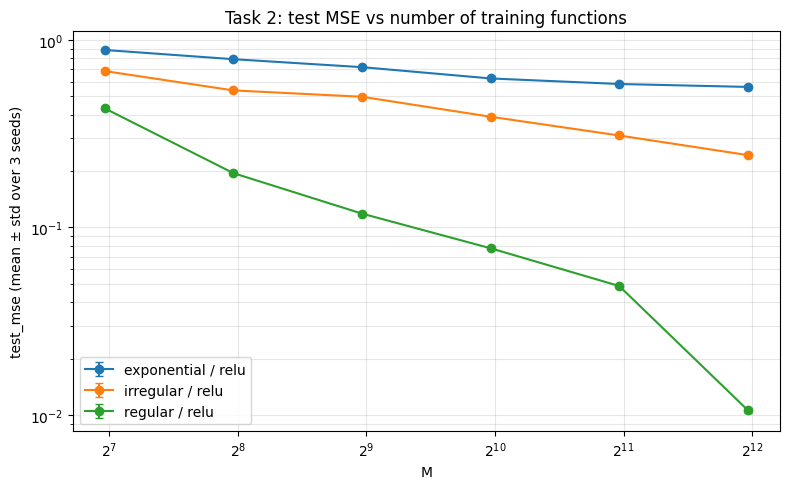
  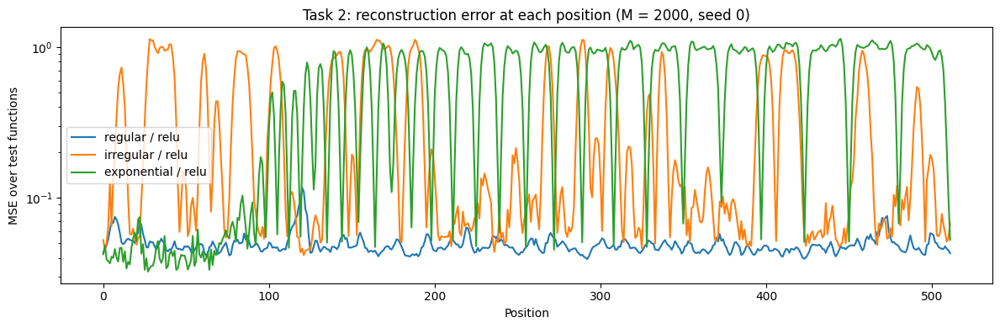<br>
  <em><b>Fig. 1.7 / 1.8</b> — Left: test MSE against the number of training functions (3x512
  ReLU). With regular sampling the error falls from 0.43 to 0.011 as M grows from 125 to 4,000,
  roughly in proportion to 1/M. Irregular (0.68 to 0.24) and exponential (0.89 to 0.56) sampling
  improve much more slowly. Right: error at each position for M = 2,000. Regular sampling is
  uniformly low; with exponential sampling the error beyond position 100 swings between low values
  at the samples and about 1 inside the gaps, where the network has no information and falls back
  to the mean.</em>
</p>

### Findings

- **Task 1.** A DNN can memorise and interpolate one band-limited function, but only with a
  suitable architecture: the deeper sin network reaches about 5% relative error, while a single
  wide layer or a deep sigmoid network learns little more than the mean. Depth helps more than width
  under a fixed neuron budget, and the main obstacle is fitting high frequencies at all. More
  training points help most around the Nyquist rate, and regular sampling consistently beats
  irregular sampling.
- **Task 2.** A DNN learns to reconstruct unseen functions from 100 samples, and with regular
  sampling its error decreases roughly as 1/M. Since reconstruction is linear, a network with no
  nonlinearity learns it essentially exactly, and every nonlinear network is worse by many orders
  of magnitude. The choice of 𝒳 matters more than any other factor tested: irregular and
  exponential sampling leave gaps whose content cannot be inferred. The DNN avoids the numerical
  breakdown of the classical method under exponential sampling, but it does not recover what is
  missing in the gaps.

---

## CA2 — Reliability: Dropout, Sparsification, and Ensembles

> *Spec: [`CA2/PDL_challenge_2.pdf`](CA2/PDL_challenge_2.pdf) · Code: [`CA2/Challenge2.ipynb`](CA2/Challenge2.ipynb) (Colab)*

### Problem setting

A network's softmax output is routinely read as a confidence, and DNNs are known to be overconfident.
The challenge measures *reliability* as a KL divergence between two 10 × 10 matrices, both computed on
the test set:

- **P(j|i)**: the empirical distribution of predictions. Given true class `i`, how often the argmax
  is `j`.
- **Q(j|i)**: the model's own claim. The average softmax vector over inputs of true class `i`.

The conditional KL is D<sub>KL</sub> = Σᵢ P(i) Σⱼ P(j|i) log[P(j|i) / Q(j|i)]. Lower is meant to
mean more reliable.

### Method

**Baseline.** The model is VGG-16 (ImageNet weights, `include_top=False`, `pooling='avg'`). The
convolutional base is **frozen**, and a trainable 512 → 256 → 10 dense head is appended on top.
Because the base never changes and there is no augmentation, the 512-d features are computed once and
the heads are trained on this cache. A check cell confirms that this matches the full model, with a
maximum difference of 5e-6. The head is trained with Adam (lr 1e-4) on 45k images; 5k are held out
for validation.

**Ensembles.** Each ensemble has five members, and each member starts from the baseline weights.
Every member gets its own fixed random mask that keeps 20% of the head, is retrained for 10 epochs,
and at inference the members' softmax outputs are averaged.

- **Task 1: node removal.** 80% of the nodes in the two hidden layers are removed. This is equivalent
  to one dropout mask, frozen for the member's lifetime.
- **Task 2: edge removal.** 80% of the weights in all three dense layers are removed (random
  sparsification).

**Reliability levers.** Each lever is applied to both ensembles:

- temperature scaling, with T chosen on the validation set;
- the conditional KL added to the loss, computed per mini-batch with λ = 1;
- L2 regularisation of 1e-4;
- bagging, i.e. bootstrap training sets;
- an extra sigmoid "confidence" output trained to predict correctness. At inference it mixes the
  softmax with the uniform distribution.

The conditional KL is reported alongside the mean confidence and the NLL.

### Results

| Model | Test acc | Cond. KL | Mean conf | NLL | Active weights |
|---|---|---|---|---|---|
| Baseline (1 model) | 0.628 | **0.0025** | 0.851 | 1.721 | 396,554 |
| Task 1 ensemble (nodes) | 0.688 | 0.0230 | 0.723 | 0.953 | 5 × 58,099 |
| Task 2 ensemble (edges) | 0.691 | 0.0196 | 0.738 | 0.950 | 5 × 79,933 |
| Task 1 + Task 2 combined (10 members) | **0.701** | 0.0259 | 0.722 | **0.903** | — |
| Task 1 + KL in the loss | 0.684 | 0.0177 | 0.741 | 0.980 | 5 × 58,099 |
| Task 2 + KL in the loss | 0.692 | 0.0153 | 0.759 | 0.977 | 5 × 79,933 |
| Task 2 + temperature (T = 0.5) | 0.689 | 0.0081 | 0.799 | 1.255 | 5 × 79,933 |
| Task 2 + bagging | 0.685 | 0.0177 | 0.739 | 1.045 | 5 × 79,933 |
| Task 2 + confidence branch | 0.690 | 0.0574 | 0.659 | 0.956 | 5 × 79,933 |

L2 at 1e-4 changed nothing measurable in either task. The full table, with the Task 1 versions of
every lever, is in the notebook.

<p align="center">
  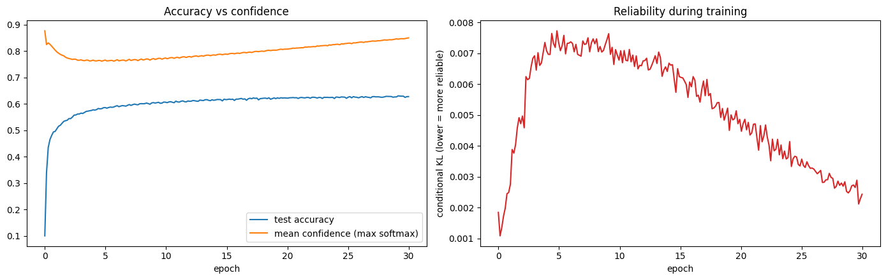<br>
  <em><b>Fig. 2.1</b> — Baseline head, evaluated on the test set every 25 steps. At initialisation the
  head reports 0.88 mean confidence at 10% accuracy. Accuracy then plateaus near 0.63, while confidence
  climbs back to 0.85. Meanwhile train accuracy reaches 99.4%. The conditional KL (right) rises and then
  <b>falls</b> during this over-fitting phase: it does not track the overconfidence.</em>
</p>

<p align="center">
  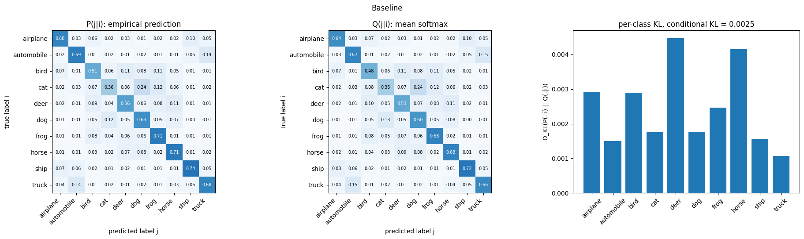<br>
  <em><b>Fig. 2.2</b> — P and Q for the baseline. They agree almost cell for cell, so every per-class KL is
  below 0.005. Cat is the hardest class (36% correct, 24% called dog), yet it has one of the lowest KLs.</em>
</p>

<p align="center">
  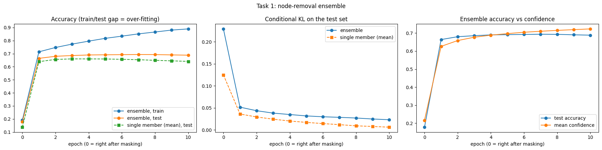<br>
  <em><b>Fig. 2.3</b> — Task 1 ensemble during retraining. Epoch 0 is just after masking, when accuracy
  has collapsed to 18%. The individual members over-fit: their test accuracy peaks at epoch 3–4. The
  averaged ensemble stays flat at about 0.69, and its confidence tracks its accuracy closely.</em>
</p>

<p align="center">
  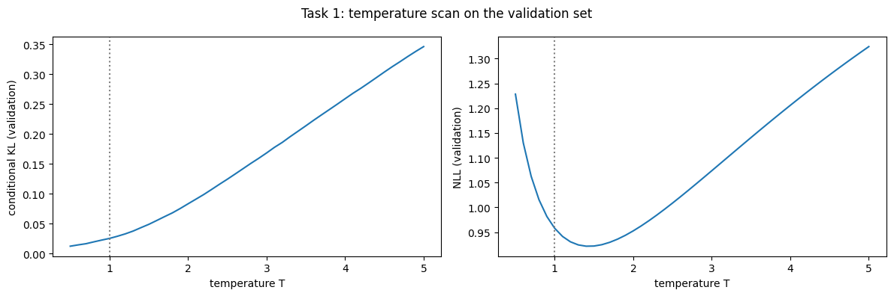<br>
  <em><b>Fig. 2.4</b> — Temperature scan on the validation set. The conditional KL increases
  monotonically with T, so minimising it picks the sharpest temperature on the grid (0.5). The NLL is
  minimised near T ≈ 1.4, the usual "soften an overconfident model" result.</em>
</p>

<p align="center">
  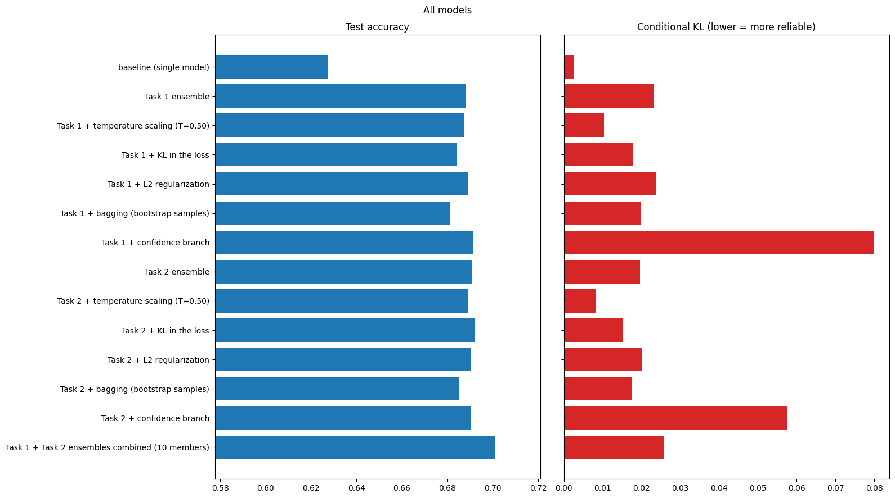<br>
  <em><b>Fig. 2.5</b> — All models: test accuracy and conditional KL.</em>
</p>

### Findings

1. **Ensembles fix both accuracy and overconfidence.**
   - Five members, each keeping only 20% of the nodes or edges, gain about 6 points of accuracy over the
     baseline. They use 73% (nodes) and 101% (edges) of the baseline's active weights.
   - Over-fitting drops: the train/test gap is 0.20–0.23, against 0.36 for the baseline.
   - Overconfidence nearly disappears: mean confidence minus accuracy falls from +0.22 to +0.03 / +0.05,
     and the NLL almost halves.
2. **Edge removal gives stronger members than node removal.** Task 2 members average 0.651 against 0.641
   for Task 1, because no hidden layer is squeezed to 102/51 units. After averaging, the two ensembles
   are practically equal.
3. **The spec's conditional KL rewards sharp outputs, not calibrated ones.**
   - If every softmax is one-hot, Q = P exactly and the KL is zero, whatever the accuracy.
   - That is why the over-fitted baseline has the lowest KL of all models, why averaging members raises it,
     and why minimising it over T always sharpens the outputs.
   - The KL is only meaningful next to an accuracy- or likelihood-based measure. Here those measures point
     the other way.
4. **Of the levers, adding the KL to the loss is the most useful.** It cuts the KL by about 22% in both
   tasks at a cost of at most 0.4 points of accuracy. Bagging lowers the KL but costs accuracy and NLL.
   L2 at 1e-4 is inert. The confidence branch over-corrects into underconfidence (0.66 confidence at
   0.69 accuracy).

### Caveats

- **The spec's 70% target was not reached.** Frozen ImageNet features on 32×32 inputs cap the head
  near 63% validation accuracy, so the baseline trained for its full 30 epochs and is heavily
  over-fitted when the ensembles start from it.
- **The spec uses `weights=None`.** With a frozen, randomly initialised base, 70% is out of reach
  altogether, so ImageNet weights are used instead.
- **The temperature was chosen to minimise the conditional KL**, which is why T = 0.5 is reported.
  The notebook can instead choose it by NLL (`TEMPERATURE_CRITERION = 'nll'`); that version has not
  been run.
- **Single run.** Each configuration was trained once with one seed and one value of λ, and the
  run-to-run variance was not measured. The smaller differences (under about 0.5 points of accuracy)
  should not be read as meaningful.

---

## CA3 — NLP with CNN, RNN, and GRU

> *Spec: [`CA3/PDL_challenge_3.pdf`](CA3/PDL_challenge_3.pdf) · Code: [`CA3/Challenge3.ipynb`](CA3/Challenge3.ipynb) (Colab, T4 GPU)*

### Problem setting

Binary sentiment classification on the Large Movie Review Dataset (IMDB, 25k train / 25k test),
with the vocabulary capped at the 5,000 most frequent tokens and every review padded or truncated
to 500 tokens. The question is less about the accuracy number than about how **sequence length,
word order and padding** interact with each architecture.

### Method

The training set is split at 100 tokens into a short subset (2,822 reviews) and a long subset
(22,178 reviews). CNN, SimpleRNN, GRU and LSTM models are each trained on both subsets and
evaluated on the full test set, which is 88% long reviews.

All models share a 32-dimensional embedding and are held to the same budget of **K ≈ 10,000
trainable parameters outside the embedding** (CNN 8,801, RNN 9,121, GRU 8,921, LSTM 9,147). The
embedding is identical in every model, so this keeps capacity comparable and attributes any
difference to the architecture. The recurrent models use `mask_zero=True`, so they skip the
padding and classify from the hidden state after the last real word. Training uses Adam with
EarlyStopping (patience 2) on a 20% validation split.

On top of accuracy, the notebook measures:
- **Accuracy by review length**, bucketed by the original, unpadded length.
- **Order sensitivity**, by permuting the words of each test review at inference time.
- **Gradient flow**, as the norm of the loss gradient with respect to each input token, against
  its distance from the last token.
- **Padding strategies**, on an unmasked GRU trained on short reviews: pre, post and centered
  zero padding, and post padding with 0, 1 or random 0/1 values.

### Results

<p align="center">
  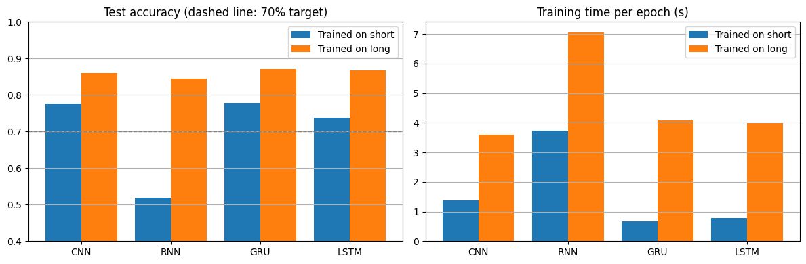<br>
  <em><b>Fig. 3.1</b> — Test accuracy (left) and training time per epoch (right). Every model
  trained on long reviews beats its short-review counterpart. GRU is the most accurate on both
  subsets. SimpleRNN is both the least accurate and the slowest, since it has no cuDNN kernel.</em>
</p>

| Architecture | Params | Acc. (trained on short) | Acc. (trained on long) | Test loss (long) | s/epoch (long) |
|--------------|--------|-------------------------|------------------------|------------------|----------------|
| CNN  | 8,801 | 77.7% | 86.0% | 0.331 | 3.6 |
| RNN  | 9,121 | **51.9%** | 84.5% | 0.379 | 7.1 |
| GRU  | 8,921 | 77.8% | **87.1%** | 0.328 | 4.1 |
| LSTM | 9,147 | 73.7% | 86.7% | **0.317** | 4.0 |

All models reach the spec's 70% target except the RNN trained on short reviews. Its train loss
falls to 0.46 while its val loss stays at 0.69: it memorizes the 2,257 training reviews without
generalizing. For reference, a much larger baseline CNN (610k parameters, full training set)
reaches only 85.8% and overfits from the first epoch, so 70x more capacity buys nothing.

<p align="center">
  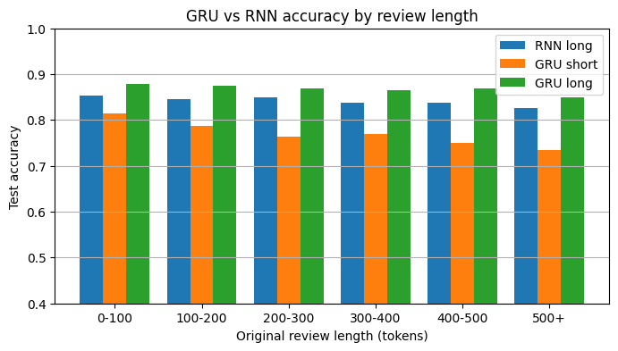<br>
  <em><b>Fig. 3.2</b> — Accuracy by original review length. The models trained on long reviews
  are nearly flat (GRU 87.8% on 0-100 tokens, 85.0% on 500+). The GRU trained on short reviews
  degrades steadily from 81.4% to 73.4% as inputs move away from its training distribution. It
  is worse than GRU long even on the 0-100 bucket it was trained on, so data volume matters more
  than matching the length distribution.</em>
</p>

| Permutation at inference | RNN long | GRU short | GRU long |
|--------------------------|----------|-----------|----------|
| Original            | 84.5% | 77.8% | 87.1% |
| Shuffle within 10   | 84.1% | 77.7% | 87.0% |
| Shuffle first half  | 84.1% | 77.8% | 87.1% |
| Shuffle second half | 83.8% | 75.1% | 86.4% |
| Full shuffle        | 83.3% | 73.8% | 86.2% |
| Reverse             | 82.0% | 71.3% | 84.9% |

Shuffling words locally costs almost nothing, and even a full shuffle costs only 1-4 points:
sentiment in IMDB is carried mostly by individual words. This is why the CNN keeps up with the
recurrent models. What order sensitivity there is sits at the **end** of the review. Shuffling the
second half hurts more than shuffling the first, and reversing, which moves the ending furthest
from the output, hurts the most.

<p align="center">
  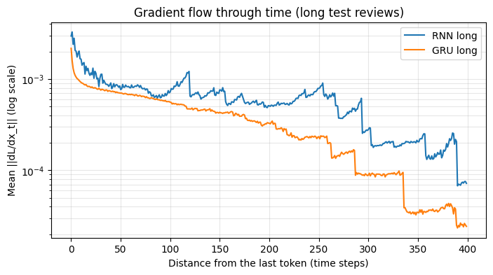<br>
  <em><b>Fig. 3.3</b> — Mean input-gradient norm against distance from the last token, on long
  test reviews. Both models weight recent tokens most. The GRU's curve decays about an order of
  magnitude more than the RNN's over 400 steps. The sharp drops are an averaging artefact: at
  large distances only the longest reviews contribute.</em>
</p>

The gradient measure says how much the prediction depends on each token. It falls both when
gradients vanish and when a model has *learned* to discount distant tokens. So Fig. 3.3 does not
show the GRU remembering further back than the RNN. Together with the permutation results, its
advantage looks like better use of recent context.

<p align="center">
  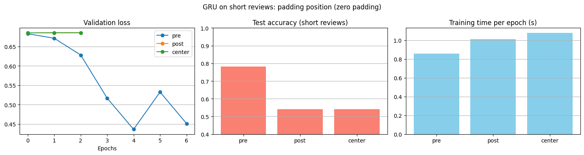<br>
  <em><b>Fig. 3.4</b> — Padding position for an unmasked GRU trained on short reviews, each
  padded to 500 tokens. Only pre-padding learns (78.3%). Post- and centered padding stay at 54.05%,
  predicting the same class for every review, and stop after 3 epochs. Time per epoch is
  unaffected.</em>
</p>

### Interpretation

The padding result is the **opposite of what the spec suggests** (section 3.3 argues post-padding
is better for recurrent models). A model that classifies from its final hidden state needs the
content close to the output. With post-padding, at least 400 steps of padding separate a short
review's last word from the output. The signal does not survive them, and the model never gets
off the ground. Centered padding still leaves at least 200 steps and fails the same way. Masking
removes the problem entirely: the masked models above use post-padding with no difficulty.

The padding-value experiment (0, 1 or random 0/1, all with post-padding) is **inconclusive**. All
three runs fail exactly like post-padding above, so the value never gets a chance to matter.
Isolating it would require rerunning with pre-padding. Note also that 1 is the `<START>` token in
this vocabulary, so "one-padding" appends a run of `<START>` tokens.

> **Status.** Two parts of the spec are not covered: the RNN trained on short reviews stays below
> the 70% target, and the padding-value comparison needs a rerun with pre-padding. The
> word-frequency and vocabulary analysis for the CNN is not implemented. All results come from a
> single seed, so differences under about one point should not be over-interpreted.

---

## CA4 — Word Embeddings with BERT

> *Spec: [`CA4/PDL_challenge_4.pdf`](CA4/PDL_challenge_4.pdf) · Code: [`CA4/Challenge4.ipynb`](CA4/Challenge4.ipynb) (Colab, T4 GPU)*

### Problem setting

CA3's recurrent models read a review one token at a time. BERT replaces recurrence with
multi-head self-attention, so every token attends to every other token in one parallel step.
This challenge fine-tunes BERT on the same IMDB sentiment task. It then asks what the embeddings
look like before and after fine-tuning, and whether clustering them reveals structure beyond
positive versus negative.

### Method

Everything is in one PyTorch + HuggingFace notebook built on `bert-base-uncased`. The data is the
official IMDB split: 25k train / 25k test, both balanced. 2,500 training reviews are held out for
validation, and `<br />` tags are stripped.

- **Pre-trained embeddings.** For 2,000 training reviews, the last hidden layer of the untouched
  model is reduced to one 768-d vector per review, using both the `[CLS]` token and mean pooling.
  Each is projected to 2-D with PCA and t-SNE.
- **Fine-tuning.** A 64-d bottleneck sits between BERT and the classifier:
  `pooled output (768) -> Linear(768, 64) -> tanh -> Linear(64, 2)`. The whole network is trained
  end to end for 2 epochs. Training uses AdamW (`lr = 2e-5`) with 10% linear warmup, batch size
  32, `max_len = 256` and mixed precision. Each epoch takes about 5 minutes on a T4. The spec's
  own example is written in TensorFlow; the bottleneck is added because section 7 of the spec asks
  for clustering on 64-d embeddings.
- **Evaluation.** The test set is used once. From that pass the notebook reports accuracy,
  precision, recall and F1, the most positive and most negative reviews, and the most confident
  mistakes.
- **Clustering.** K-means runs on the standardized 64-d test embeddings for k = 2 to 10, and k is
  chosen with the elbow method and the silhouette score. Each cluster is then described by its
  label mix, its distinctive TF-IDF words, and how often it mentions ten theme word lists (visual,
  story, acting, music, emotion, horror, boredom, ...) compared with the whole test set.

### Results

<p align="center">
  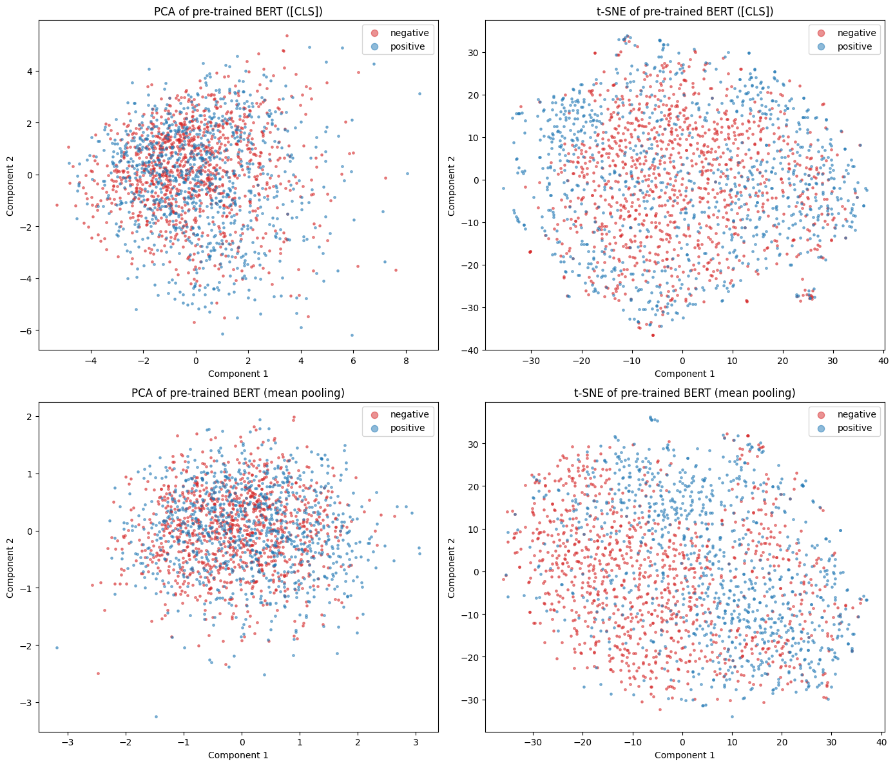<br>
  <em><b>Fig. 4.1</b> — Pre-trained (not fine-tuned) BERT review embeddings. Top: <code>[CLS]</code>;
  bottom: mean pooling; left: PCA; right: t-SNE. In PCA the two classes overlap completely.
  t-SNE on mean-pooled vectors shows only a weak left/right tendency. Without fine-tuning,
  sentiment is not a dominant direction of the embedding: BERT encodes what a review is about
  more than how the reviewer felt.</em>
</p>

| Epoch | Train loss | Train acc. | Val acc. |
|-------|------------|------------|----------|
| 1 | 0.326 | 85.7% | 91.7% |
| 2 | 0.160 | 94.5% | 91.9% |

Almost all of the gain comes in the first epoch. The widening train/validation gap in epoch 2
means more epochs would start to overfit.

| Test set (25,000 reviews) | Accuracy | Precision | Recall | F1 |
|---------------------------|----------|-----------|--------|----|
| Fine-tuned `bert-base-uncased` | **92.15%** | 0.910 | 0.935 | 0.923 |

This is 5 points above the best CA3 model (GRU, 87.1%), and it still truncates 41% of reviews at
256 tokens.

<p align="center">
  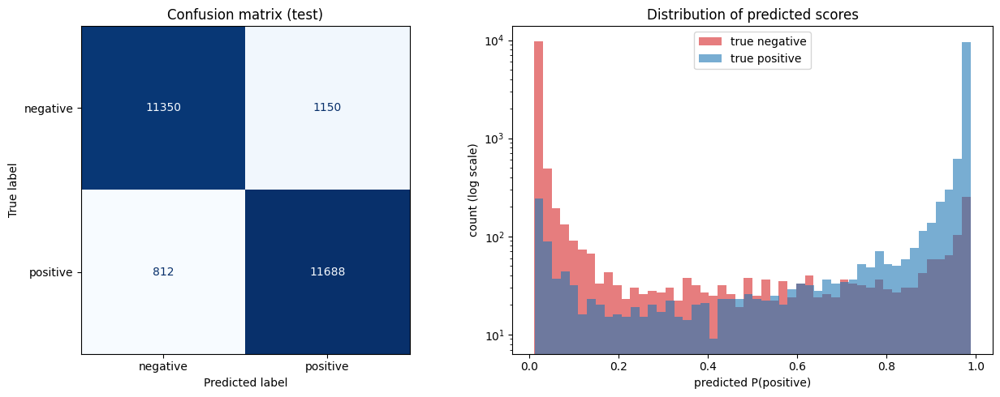<br>
  <em><b>Fig. 4.2</b> — Left: confusion matrix. The model makes more false positives (1,150)
  than false negatives (812). Right: distribution of predicted P(positive), log scale. Almost all
  reviews sit in the two extreme bins. The <code>tanh</code> bottleneck saturates, so scores cap at
  about 0.989 / 0.011, and the "top 5" most positive and most negative reviews are in fact tied.</em>
</p>

The most extreme reviews on both sides are unambiguous ("the acting is superb, I recommend it" /
"a disappointing mess, don't waste a second"), so at the extremes the model agrees with a human
reader. The most confident mistakes fall into three groups:

1. **Sarcasm.** Examples are "one of the all time greatest horror movies" about a Charles Band
   film, and "Master P's acting skills make you actually believe he is Italian". The words are
   positive and the intent is negative.
2. **"So bad it's good".** "Crassly pandering hunk of blithely rancid ... junk" is labelled
   positive: the reviewer enjoys the film because it is trashy.
3. **Labels that contradict the text.** "Absolute and utter filth" is labelled positive. These look
   like label noise.

Groups 1 and 2 both push negative reviews toward a positive prediction, which is consistent with
the excess of false positives.

<p align="center">
  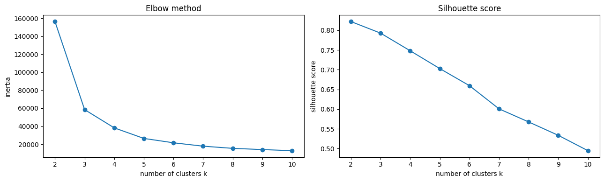<br>
  <em><b>Fig. 4.3</b> — K-means on the fine-tuned 64-d embeddings. The silhouette score (right) is
  highest at k = 2 (0.822) and falls steadily. The inertia curve (left) has a sharp elbow at
  k = 3, where inertia drops from 156k to 58k. k = 3 keeps a high silhouette (0.793) and was used
  for interpretation.</em>
</p>

<p align="center">
  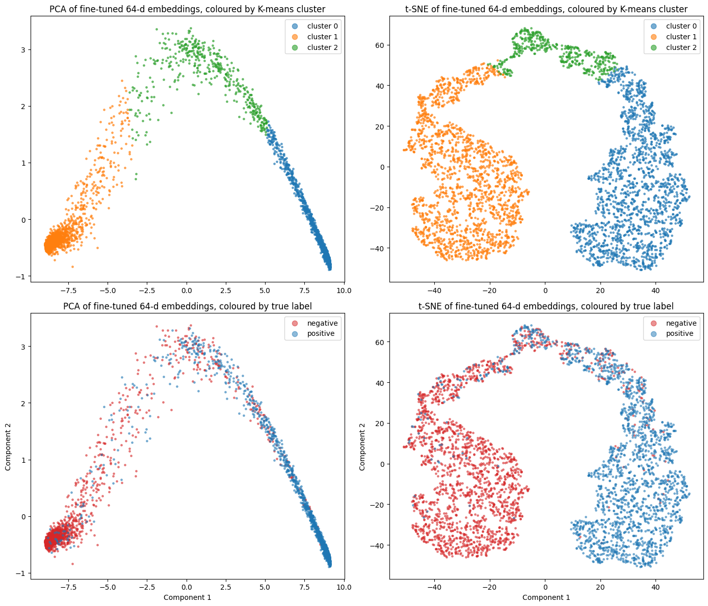<br>
  <em><b>Fig. 4.4</b> — PCA and t-SNE of 4,000 test embeddings, coloured by cluster (top) and by
  true label (bottom). After fine-tuning the space is essentially one-dimensional. PCA shows an
  arc from the negative pole to the positive pole, and cluster 2 is the bridge between them.
  Compare Fig. 4.1: fine-tuning is what creates the separation.</em>
</p>

| Cluster | Size | % positive | Mean P(pos) | Mean words | Distinctive words | Label |
|---------|------|------------|-------------|------------|-------------------|-------|
| 0 | 10,891 | 96.1% | 0.983 | 215 | great, love, excellent, wonderful, beautiful, music, favorite | Enthusiastic, emotionally engaged |
| 1 | 11,287 | 4.3% | 0.021 | 220 | bad, worst, awful, waste, boring, stupid, minutes, money | Dismissive, bored |
| 2 | 2,822 | 55.0% | 0.631 | 296 | man, wife, police, dead, doctor, car, pretty, course | Ambivalent, retells the plot |

<p align="center">
  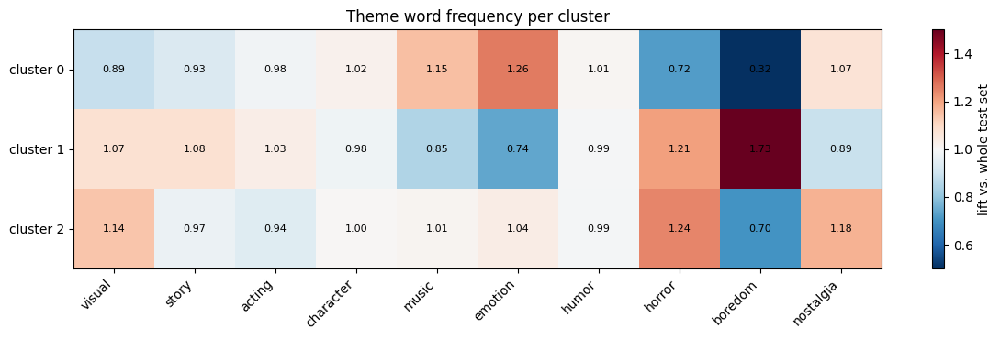<br>
  <em><b>Fig. 4.5</b> — How often each cluster mentions a theme, relative to the whole test set
  (above 1 means over-represented). Positive reviews lean on emotion (x1.26) and music (x1.15), and
  negative reviews on boredom (x1.73). Cluster 2 over-represents horror, nostalgia and visuals. The
  visual, story, acting and character themes stay between about 0.9 and 1.15 in every cluster.</em>
</p>

### Interpretation

Clusters 0 and 1 are the two sentiment poles and hold 88% of the test set. Cluster 2 is the only
structure beyond positive versus negative. Its reviews are about 35% longer, split evenly between
labels, and get uncertain scores. Their distinctive words are plot-summary nouns and hedges
rather than evaluative words: these reviewers mostly retell the story, often of genre films or
older classics, and give a mixed verdict.

Aspect themes such as visuals, story or acting do **not** form their own clusters. This is expected
from the objective: fine-tuning on binary labels collapses the 64-d embedding onto the sentiment
axis, plus a confidence dimension. The themes are present in the text, as the lifts in Fig. 4.5
show, but not in the embedding. Two practical consequences follow:

- Cluster 2 behaves like a "mixed" class. A three-way output, or routing low-confidence reviews
  elsewhere, would help more than further binary tuning.
- Recommendations based on what a viewer values (visuals vs. story) would need aspect-based
  sentiment, or embeddings that are not fine-tuned only on polarity.

> **Status.** All spec sections are covered. The results come from a single run and seed, and
> reviews longer than 256 tokens are truncated. The cluster labels are qualitative, based on
> keywords and sample reviews.

---

## Final Project — Symbolic Music Generation

> *[`FinalProject/`](FinalProject/)*

Generating polyphonic piano MIDI with a recurrent language model over musical notes.

### The corpus is synthesised from stock prices, not collected from music

This is the defining design decision of the project and it is easy to miss.
[`Generate_mid/`](FinalProject/MusicGenerator/Generate_mid/) builds the entire 100-file training
pool (`MusicGenerator/pool/*.mid`) procedurally from **Taiwan Stock Exchange weekly closing
prices**:

1. `get_stock.ipynb` pulls two years of daily and weekly data for eight tickers via `yfinance` —
   2888, 2344, 2610, 3481, 2317, 2371, 4562, and 1802 (all `.TW`).
2. `Generate_mid.ipynb` assigns each ticker one degree of a randomly permuted C-major scale
   (MIDI pitches 60, 62, 64, 65, 67, 69, 71, 72). Walking each ticker's weekly series, **every
   week that closes more than 2% above the previous week emits one note** at that ticker's pitch,
   with a duration drawn uniformly from {30, 60, 120, 180, 240} ticks.
3. The resulting note list is then **randomly permuted** (`np.random.permutation`) before being
   written out with `mido`. A new scale permutation is drawn for each of the 100 files.

The consequence matters for reading any result below: because the final shuffle destroys temporal
order, the corpus carries **almost no learnable sequential structure**. What remains is the
marginal distribution over pitches and durations — a unigram statistic. A sequence model trained
on it can learn which notes are common, but there is nothing consistent for its recurrence to
capture, by construction.

### Pipeline

1. **Parse** — `pretty_midi` reads each `.mid` into `Note(start, end, pitch, velocity)` events.
2. **Quantise** — events are binned into a piano-roll at 5 frames/second, giving a
   `{timestep: [pitches]}` dictionary. Simultaneous pitches at one timestep form a chord token.
3. **Tokenise** — a custom `NoteTokenizer` builds a chord-string ↔ index vocabulary, with a
   dedicated `'e'` token for rests.
4. **Model** — `Embedding(vocab, 100)` → `Bidirectional(GRU(128))` → `Dropout(0.3)` →
   `Bidirectional(GRU(128))` → dense → softmax over the vocabulary, trained with sparse categorical
   cross-entropy and Nadam on 5-timestep context windows.
5. **Generate** — autoregressive sampling from either random noise or a seeded first note
   (e.g. middle C = pitch 60), decoded back to `.mid` by inverting the piano-roll.

<p align="center">
  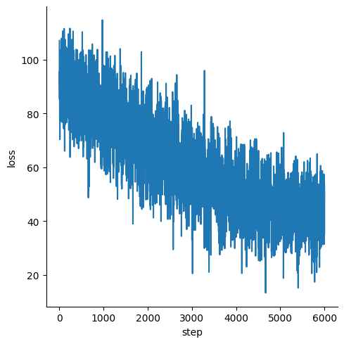<br>
  <em><b>Fig. F.1</b> — Training loss over ~6,000 steps (20 epochs). The trend is clearly
  downward, from ~85 to ~48, but the per-step variance is enormous and never contracts. Both
  features follow from the corpus described above. The descent is the model learning the marginal
  note distribution, which is genuinely learnable. The variance floor is the part that cannot
  improve: with <code>batch_song = 1</code> every step sees one shuffled file, and since the
  shuffle removed any order information, the conditional entropy given the 5-step context never
  drops below the unconditional entropy. A model that plateaus at the unigram baseline is the
  correct outcome here, not an optimisation failure.</em>
</p>

### Sub-folders

- `MusicGenerator/` — the working implementation, plus two generated samples
  (`example1.mid` from random seed, `example2.mid` seeded on pitch 60).
- `MusicGenerator/Generate_mid/` — the stock-to-MIDI corpus generator and its cached `stock/*.csv`.
- `Test/` — a working copy.
- `example1/`, `example2/` — third-party reference implementations retained for comparison.

#### Provenance of the vendored reference code

These three directories began as clones of public repositories and were then modified locally.
Their nested `.git` directories have been removed, so the upstream history is no longer available
in-tree; the table below records where each came from and the commit it was taken at.

| Directory | Upstream | Commit | Model |
|-----------|----------|--------|-------|
| `example1/` | [xiaohuiduan/lstm-music](https://github.com/xiaohuiduan/lstm-music) | `3bd7770` (2021-02-04) | LSTM over note sequences |
| `example2/` | [cmd23333/MusicGenerator](https://github.com/cmd23333/MusicGenerator) | `c816709` (2020-05-05) | Bi-GRU over piano-roll |
| `Test/` | [cmd23333/MusicGenerator](https://github.com/cmd23333/MusicGenerator) | `c816709` (2020-05-05) | Working copy of the above |

All three carry local edits that diverge from upstream, so they are **not** clean checkouts — diff
against the linked commit before assuming any file is unmodified.
