# Deep Learning — Challenge Portfolio

> 深度學習 · 113 學年度下學期 (Spring 2025)

Coursework and experiments for the **PDL (Practical Deep Learning)** challenge series, plus a
set of standalone generative-model implementations and a final project on symbolic music
generation.

The five challenges (`CA0`–`CA4`) form a deliberate progression through the modern deep-learning
stack: from the statistics of a training set, through function approximation theory, model
calibration, sequence modelling, and finally self-attention and transfer learning.

| # | Folder | Topic | Backbone | Dataset |
|---|--------|-------|----------|---------|
| 0 | [CA0/](CA0/) | Class imbalance & per-class robustness | ResNet-18 | CIFAR-10 |
| 1 | [CA1/](CA1/) | Function upscaling & the role of activations | MLP | Synthetic band-limited signals |
| 2 | [CA2/](CA2/) | Reliability, calibration, dropout ensembles | VGG-16 | CIFAR-10 |
| 3 | [CA3/](CA3/) | Sequence models & padding dynamics | CNN / RNN / GRU | IMDB |
| 4 | [CA4/](CA4/) | Contextual word embeddings | BERT | IMDB |
| — | [GAN/](GAN/), [RBM/](RBM/) | Generative models from scratch | — | `sklearn` digits |
| — | [FinalProject/](FinalProject/) | Symbolic music generation | Bi-GRU | MIDI synthesised from stock prices |
| — | [PDL/](PDL/) | Reference code (*Python Deep Learning*, Packt) | — | — |

Each challenge folder contains the **assignment specification** (`PDL_challenge_*.pdf`) next to
the notebooks that answer it. Figures below are the actual outputs stored in those notebooks —
nothing is re-drawn or idealised.

---

## CA0 — Investigating ResNet-18 under Heterogeneous CIFAR-10

> *Spec: [`CA0/PDL_challenge0.pdf`](CA0/PDL_challenge0.pdf) · Code: [`CA0/Challenge 0.ipynb`](CA0/Challenge%200.ipynb)*

### Problem setting

CIFAR-10 is perfectly balanced by construction — 6,000 images per class. Real datasets are not.
The question is how the *per-class* behaviour of a CNN degrades when that balance is broken, and
whether a purely loss-side intervention can recover it.

### Method

A configurable loader takes a count vector **N** = [N₁, …, N₁₀] and materialises a CIFAR-10 subset
with exactly `Nₖ` examples of class `k`, split 80/20 into train and evaluation folds. The model is
`torchvision` ResNet-18 with the final FC replaced by a 10-way linear head, trained with Adam and
cross-entropy for 20 epochs.

Three regimes are compared:

1. **Balanced baseline** — **N** = [4000]×10, repeated over 10 random head initialisations.
2. **Controlled imbalance** — for each `k`, `N_k = 6000` and `N_j = 3777` for `j ≠ k`. Ten such
   datasets, ten initialisations each.
3. **Mitigation** — the same imbalanced datasets, but with
   `nn.CrossEntropyLoss(weight=class_weights)` where the weights come from
   `sklearn.utils.class_weight.compute_class_weight(class_weight='balanced', …)`.

### Results

<p align="center">
  <br>
  <em><b>Fig. 0.1</b> — Balanced baseline, one initialisation. Training accuracy climbs past 97%
  while evaluation accuracy saturates near 80%. The ~17-point gap that opens after epoch 5 is the
  overfitting signature the spec asks us to look for; the evaluation curve is flat, not
  decreasing, so the model memorises without actively degrading.</em>
</p>

<p align="center">
  <br>
  <em><b>Fig. 0.2</b> — Per-class score averaged over 10 trained models on the balanced dataset.
  Accuracy is <b>not</b> uniform even when the data is: <code>cat</code> (0.64) and
  <code>dog</code> (0.69) trail <code>ship</code> and <code>car</code> (~0.88) by more than 20
  points. The confusable animal classes are intrinsically harder, which sets the floor against
  which any imbalance effect must be measured.</em>
</p>

<p align="center">
  <br>
  <em><b>Fig. 0.3</b> — The full simulation campaign. Row <code>i</code> is the dataset in which
  class <code>i</code> was over-represented (6000 vs 3777); column <code>j</code> is the evaluated
  class. Left: unweighted cross-entropy. Right: class-weighted cross-entropy. The
  weighted-loss panel is marginally flatter, but the two are close enough that the intervention
  cannot be called decisive at this imbalance ratio (1.59:1) — a genuinely mild skew compared to
  the long-tailed regimes where re-weighting is known to matter.</em>
</p>

### Caveats worth knowing before citing these numbers

These are real limitations of the implementation, recorded here rather than hidden:

- **The "test" fold is carved out of CIFAR-10's *training* split** via `random_split`, and it is
  re-drawn on every loader call. Across the repeated initialisations, examples the network already
  trained on leak into later evaluation folds. This is the most likely explanation for the 0.96–1.00
  band in Fig. 0.3 versus the ~0.80 in Fig. 0.1.
- **`reset_weights` only re-initialises `nn.Linear` layers.** The convolutional and BatchNorm
  weights carry over between runs, so the ten "independent initialisations" share a backbone that
  keeps accumulating training. They are better read as a warm-start sequence than as ten i.i.d. draws.
- **`evaluate_model` reports `precision_score(average=None)`**, which is per-class *precision*, not
  the per-class recall/accuracy the spec describes. Fig. 0.2 and Fig. 0.3 should be read as
  precision.

---

## CA1 — Neural Function Upscaling and the Role of Activations

> *Spec: [`CA1/PDL_challenge_1.pdf`](CA1/PDL_challenge_1.pdf) · Code: [`CA1/Challenge1.ipynb`](CA1/Challenge1.ipynb), [`CA1/Task1.py`](CA1/Task1.py), [`CA1/Task2.py`](CA1/Task2.py)*

### Problem setting

Reconstructing a signal from samples is classically solved by sinc interpolation under
Nyquist–Shannon. This challenge asks what a DNN does with the same problem, and where its
inductive bias helps or hurts.

Band-limited functions are synthesised in the frequency domain: draw 50 complex Fourier
coefficients, impose Hermitian symmetry (`c₋ₖ = c̄ₖ`) so the inverse FFT is real-valued, and
transform to a length-512 discrete signal.

```python
coefficients            = np.zeros(512, dtype=np.complex128)
coefficients[1:50]      = np.random.randn(49) + 1j*np.random.randn(49)
coefficients[-49:]      = coefficients[1:50][::-1].conj()   # Hermitian symmetry
time_domain_function    = np.fft.ifft(coefficients).real
```

### Task 1 — memorising a single function (10,000-neuron budget)

The network maps a scalar `x ∈ [1, 512]` to a scalar amplitude `y`, trained under MSE with Adam.

<p align="center">
  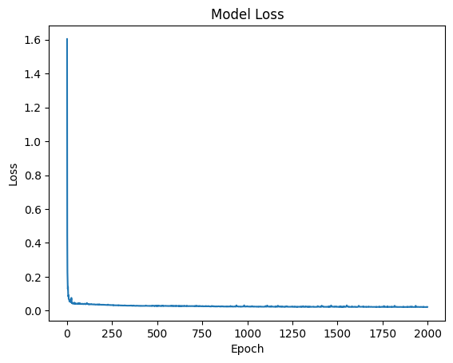
  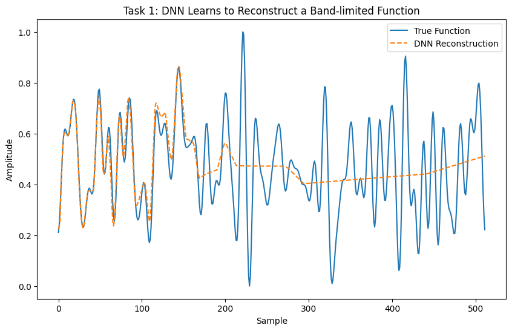<br>
  <em><b>Fig. 1.1 / 1.2</b> — Left: MSE falls from 1.6 to ~0.02 within 250 of 2,000 epochs, then
  crawls. Right: the reconstruction is near-perfect over roughly the first 170 samples and then
  <b>flattens to the signal mean</b>. This is the ReLU-MLP spectral bias in its purest form: the
  network fits low frequencies first and, given a scalar coordinate input with no positional
  encoding, simply never acquires the high-frequency detail in the rest of the domain. A final
  training MSE of 0.041 is a misleadingly good summary of a reconstruction that is qualitatively
  wrong over two thirds of its support.</em>
</p>

### Task 2 — interpolating the whole class of band-limited functions (1,000,000-neuron budget)

Now the network maps a 100-dimensional vector (the function sampled on an index set 𝒳) to the
full 512-dimensional signal. Each training example is a *different* random band-limited function,
so the model must learn the reconstruction operator itself, not one particular signal.

<p align="center">
  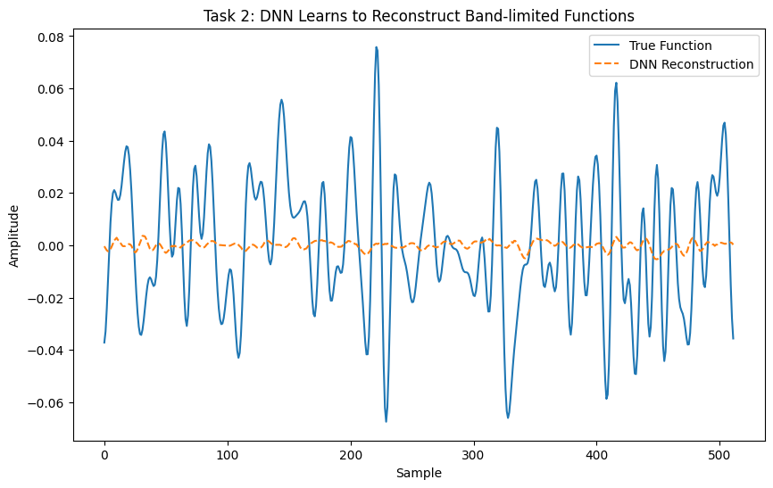
  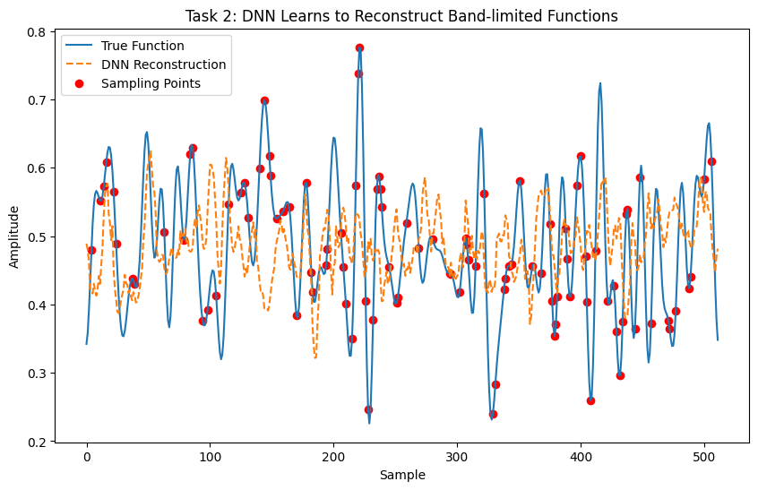<br>
  <em><b>Fig. 1.3 / 1.4</b> — Left (ReLU, M = 512, 𝒳 drawn uniformly at random): the network
  collapses onto the conditional mean, outputting a near-zero constant. Right (tanh, M = 1024):
  the output finally has the right amplitude envelope and phase alignment in places, but tracks
  the target only loosely.</em>
</p>

**Why the collapse happens.** With 50 free complex coefficients, a 100-sample observation is at
the information-theoretic boundary for exact recovery — and only when the samples are placed
suitably. Fitting a 100 → 512 operator from M = 512 examples of that operator is a badly
underdetermined regression, and under MSE the optimal response to insufficient signal is exactly
what Fig. 1.3 shows: predict the mean. The L2 regulariser (λ = 0.01) on the first layer actively
pushes toward this solution.

### Ablations recorded in the notebook

| Cell | Activation | M | Final train MSE | Behaviour |
|------|-----------|---|-----------------|-----------|
| 1 | ReLU | 512 | 0.195 | Mean collapse |
| 2 | ReLU | 512 | 0.037 | Mean collapse |
| 4 | ReLU | 512 | 0.0041 | Best MSE, still qualitatively flat |
| 5 | ReLU | 512 | 0.0118 | Oscillatory, over-amplified |
| 6 | ReLU | 1024 | 0.0112 | Larger M does not fix it |
| 7 | tanh | 1024 | 0.0135 | Best *qualitative* fit |

The headline finding is that **MSE ranks these models in almost the opposite order to visual
fidelity**. The lowest-loss ReLU run (0.0041) produces a flat line; the tanh run with 3× the loss
produces the only reconstruction with plausible structure. Choosing a loss that matches the task
matters more here than choosing an architecture.

---

## CA2 — Reliability: Dropout, Sparsification, and Ensembles

> *Spec: [`CA2/PDL_challenge_2.pdf`](CA2/PDL_challenge_2.pdf) · Code: [`CA2/Challenge2new.ipynb`](CA2/Challenge2new.ipynb) (Colab), [`CA2/Challenge2.ipynb`](CA2/Challenge2.ipynb)*

### Problem setting

A network's softmax output is routinely read as a confidence. It usually is not one — DNNs are
systematically overconfident. The challenge formalises *reliability* as a KL divergence between
two 10 × 10 matrices:

- **P(j|i)** — the empirical distribution of predictions: given true class `i`, how often the model
  actually says `j`.
- **Q(j|i)** — the model's own claim: the average softmax vector over inputs of true class `i`.

D<sub>KL</sub>(P ‖ Q) = Σᵢ P(i) Σⱼ P(j|i) log[P(j|i) / Q(j|i)]

A well-calibrated model has these two matrices agree, and the divergence goes to zero.

### Method

VGG-16 (ImageNet weights, `include_top=False`, `pooling='avg'`) with the convolutional base
**frozen** and three trainable dense layers appended (512 → 256 → 10). Only the head is trained —
this keeps feature extraction fixed so that every reliability difference is attributable to the
dense layers. An exponential LR schedule (γ = 0.95) runs on top of Adam.

Two ensembling strategies are then compared against this baseline:

- **Task 1 — dropout-induced random edges.** Five copies of the head, each with dropout
  (`rate = 0.8`) between dense layers, retrained independently and averaged at inference.
- **Task 2 — sparsification.** Connections are pruned rather than randomly masked, keeping ~20% of
  the dense connections per member.

Three calibration levers are implemented on top: adding the KL term to the loss, temperature
scaling (logits ÷ T before softmax), and L1/L2 regularisation.

### Results

<p align="center">
  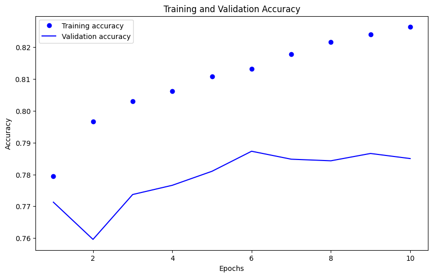<br>
  <em><b>Fig. 2.1</b> — Baseline head training. Training accuracy rises monotonically to 82.6%
  while validation stalls at ~78.5% from epoch 6 onward. The frozen ImageNet base is the binding
  constraint: 32×32 CIFAR images are far outside the resolution regime VGG-16 was pre-trained on,
  which caps the achievable accuracy near the spec's 70% target.</em>
</p>

<p align="center">
  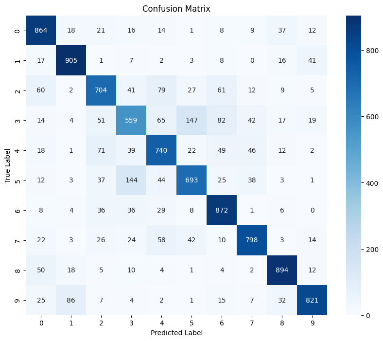
  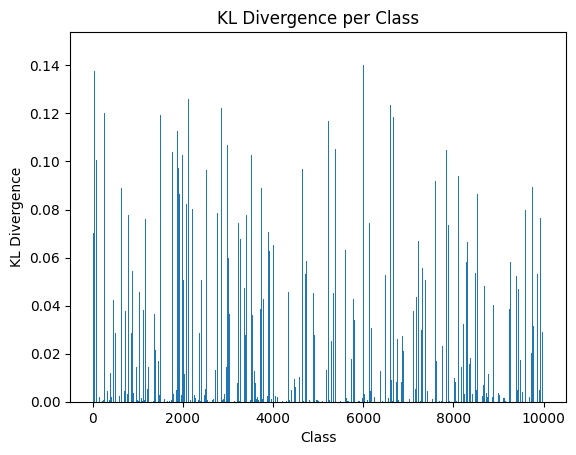<br>
  <em><b>Fig. 2.2 / 2.3</b> — Left: the confusion matrix reproduces the CA0 finding from a
  completely different architecture. The dominant off-diagonal cells are cat↔dog (147 and 144) and
  the vehicle pair automobile↔truck (86); classes 0/1/8 (plane, car, ship) exceed 860 correct.
  Errors are structured, not diffuse. Right: the divergence spectrum, which is long-tailed —
  most predictions are well matched and a sparse subset carries nearly all the miscalibration.</em>
</p>

> **Implementation note.** In the notebook, `scipy.stats.entropy(predicted_softmax.T, true_softmax.T)`
> is evaluated over the 10,000 test samples, so Fig. 2.3 is a *per-sample* divergence, not the
> per-class conditional KL of the spec; and `softmax()` is applied to already-one-hot labels, which
> is not the label distribution the definition calls for. The figure is still informative about the
> shape of the miscalibration, but it is not the scalar D<sub>KL</sub> the spec defines. The
> dropout-ensemble cells (14–17) are written but their outputs were not saved, so no ensemble
> accuracy is recorded in the notebook.

---

## CA3 — NLP with CNN, RNN, and GRU

> *Spec: [`CA3/PDL_challenge_3.pdf`](CA3/PDL_challenge_3.pdf) · Code: [`CA3/Challenge3.ipynb`](CA3/Challenge3.ipynb), [`CA3/Challenge3-3.ipynb`](CA3/Challenge3-3.ipynb)*

### Problem setting

Binary sentiment classification on the Large Movie Review Dataset (IMDB, 25k train / 25k test),
vocabulary capped at the 5,000 most frequent tokens. The real subject is not the accuracy number —
it is how **sequence length and padding strategy** interact with each architecture's inductive bias.

All architectures are held to the same budget of **K ≈ 10,000 neurons**, so any performance
difference is attributable to architecture rather than capacity.

### Method

<p align="center">
  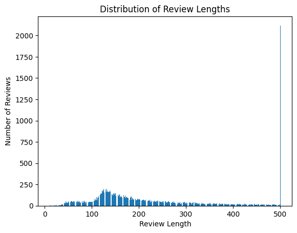<br>
  <em><b>Fig. 3.1</b> — Review-length distribution, which drives every design decision downstream.
  The mode sits near 130 tokens with a long right tail, and the spike at 500 is the truncation
  artefact: every review longer than <code>max_length</code> is clipped to that ceiling. The
  short/long split threshold was set at <b>222 tokens</b> in <code>Challenge3-3</code> — chosen
  from this histogram rather than the spec's placeholder value of 100.</em>
</p>

The dataset is then split into short (≤ 222 tokens) and long (> 222) subsets, and each of CNN /
SimpleRNN / GRU is trained on both, under both `padding='post'` and `padding='pre'`.

### Results

<p align="center">
  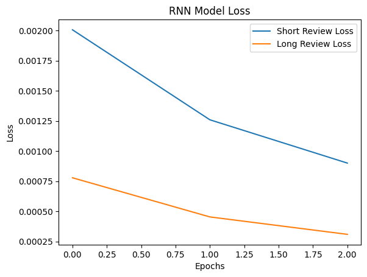<br>
  <em><b>Fig. 3.2</b> — RNN loss on the short vs long subsets. Both descend smoothly over three
  epochs with no divergence — the vanishing-gradient pathology the spec warns about does not
  appear, because post-padding keeps the informative tokens adjacent to the output layer.</em>
</p>

<p align="center">
  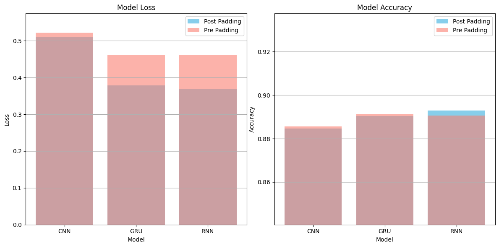<br>
  <em><b>Fig. 3.3</b> — The central result. Post- vs pre-padding across all three architectures.
  <b>Loss (left) separates sharply; accuracy (right) does not.</b> The recurrent models lose
  ~0.08–0.09 nats when switched to pre-padding (GRU 0.379 → 0.460, RNN 0.368 → 0.461) while the
  CNN barely moves (0.510 → 0.522). Accuracy shifts by well under one point in every case.</em>
</p>

| Architecture | Post-pad loss | Pre-pad loss | Post-pad acc. | Pre-pad acc. |
|--------------|---------------|--------------|---------------|--------------|
| CNN | 0.5098 | 0.5217 | 88.46% | 88.56% |
| GRU | 0.3786 | 0.4603 | 89.04% | 89.11% |
| RNN | 0.3678 | 0.4606 | 89.29% | 89.06% |

### Interpretation

The asymmetry is exactly what the architectures predict. A `Conv1D` + `GlobalMaxPooling1D` stack is
**permutation-insensitive to where the padding sits** — max-pooling discards zero activations
regardless of position, so the CNN is nearly indifferent. Recurrent models are not: with
pre-padding, the network consumes hundreds of zero steps before seeing any content, and its hidden
state has decayed by the time real tokens arrive.

The more interesting observation is that **accuracy hides this entirely.** All six configurations
land within 0.8 points of each other. Only the loss — which is sensitive to the *confidence* of
predictions, not just their argmax — reveals that pre-padded recurrent models are meaningfully
worse-calibrated. This is the same accuracy-vs-reliability distinction CA2 makes explicitly,
arrived at here by accident.

> **Status.** Cells 15/16 and 19–23 of `Challenge3.ipynb` are planned experiments — per-length-bucket
> accuracy, a token-shuffling test for order sensitivity, and centre-padding / non-zero padding
> ablations — that are stubbed as comments and not implemented.

---

## CA4 — Word Embeddings with BERT

> *Spec: [`CA4/PDL_challenge_4.pdf`](CA4/PDL_challenge_4.pdf) · Code: [`CA4/Challenge4-2.ipynb`](CA4/Challenge4-2.ipynb) (PyTorch), [`CA4/Challenge4_34.ipynb`](CA4/Challenge4_34.ipynb), [`CA4/Challenge4_567.ipynb`](CA4/Challenge4_567.ipynb) (TF Hub)*

### Problem setting

CA3's recurrent models process tokens sequentially and inherit all of the resulting long-range
problems. BERT replaces recurrence with multi-head self-attention, so every token attends to every
other in one parallel step. This challenge fine-tunes it on the same IMDB task and inspects the
representations it produces.

### Three implementations

**1. PyTorch + HuggingFace** (`Challenge4-2.ipynb`) — the full pipeline. A custom
`IMDB_Dataset` reconstructs review text from Keras' integer sequences (offsetting by 3 for the
`<PAD>` / `<START>` / `<UNK>` reserved indices), re-tokenises with `BertTokenizer`, and caps
sequences at 300 tokens. `create_mini_batch` pads to the longest sequence *per batch* rather than
to a global maximum — meaningfully cheaper than CA3's fixed 500-token padding — and builds the
attention masks. `BertForSequenceClassification` (`bert-base-uncased`, 2 labels) is fine-tuned
end-to-end with Adam at `lr = 1e-5` for 6 epochs.

**2. Embedding analysis** (`Challenge4_34.ipynb`) — loads the raw `BertModel` and projects the
last hidden layer of a single review to 2-D.

**3. TensorFlow Hub** (`Challenge4_567.ipynb`) — `small_bert/bert_en_uncased_L-4_H-512_A-8` with
the official preprocessing layer, AdamW with 10% warmup, and downstream clustering of the pooled
embeddings.

### Results

<p align="center">
  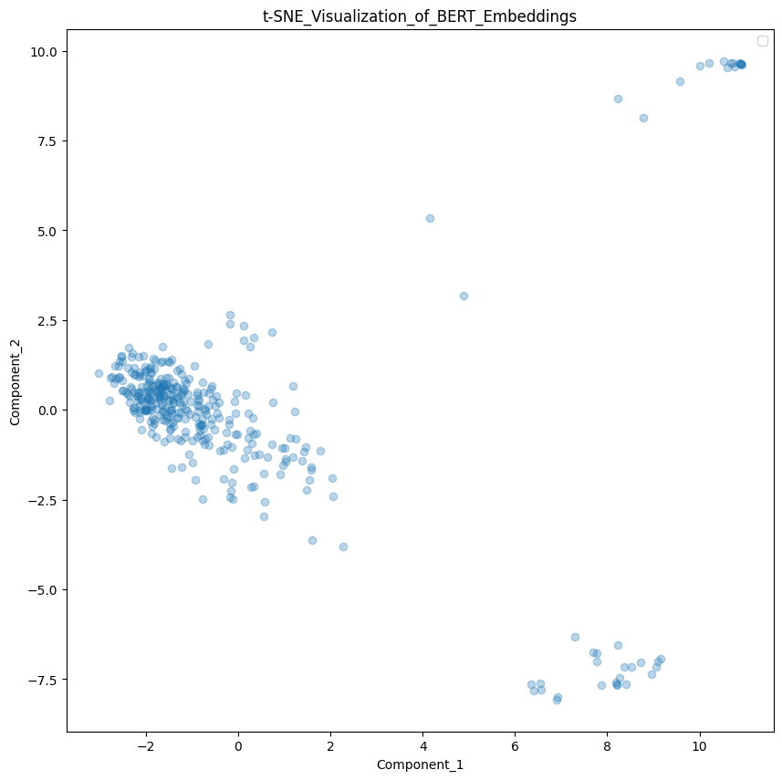
  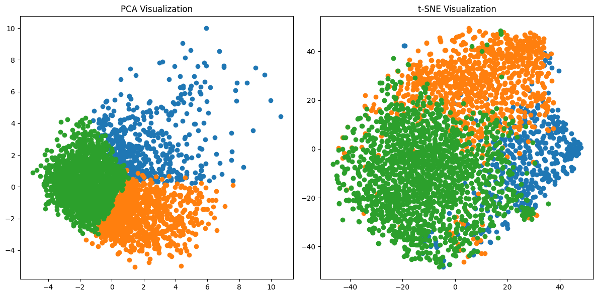<br>
  <em><b>Fig. 4.1 / 4.2</b> — Left: t-SNE of the token embeddings within one review. The structure
  is real — one dense central mass plus two well-separated satellite clusters — and it is
  <b>contextual</b>: identical wordpieces land in different places depending on surrounding text,
  which is precisely what a static embedding like word2vec cannot do. Right: PCA (linear) vs t-SNE
  (non-linear) on pooled review embeddings. PCA already achieves visible class separation along
  its first component, meaning the sentiment signal survives in a linear subspace of the pooled
  output — which is exactly why a single dense layer on top of <code>pooled_output</code> is
  sufficient for the classification head. t-SNE separates the regions more cleanly but, as always,
  its inter-cluster distances carry no metric meaning.</em>
</p>

<p align="center">
  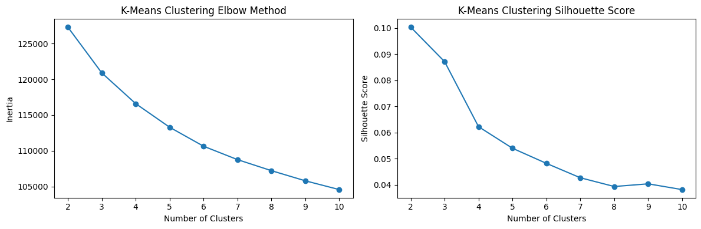<br>
  <em><b>Fig. 4.3</b> — K-means model selection on the BERT embeddings. Inertia (left) decreases
  smoothly with no elbow; the silhouette score (right) is <b>maximised at k = 2</b> and decays
  monotonically. The unsupervised optimum recovers the binary sentiment structure without ever
  seeing a label. The absolute silhouette value (~0.10) is low, which is the expected signature of
  a high-dimensional embedding space where clusters are genuine but not compactly separated.</em>
</p>

---

## Standalone generative models

### GAN — [`GAN/GAN.py`](GAN/GAN.py)

A from-scratch vanilla GAN in PyTorch on the 8×8 `sklearn` digits set (1,797 samples, 64-D).
Generator: 100-D noise → 128 → 256 → 512 → 64 with BatchNorm and a sigmoid output.
Discriminator: 64 → 512 → 256 → 128 → 1 with LeakyReLU(0.2) and dropout 0.3.
Both use Adam(lr = 2e-4, β₁ = 0.5) — the standard DCGAN setting. The generator is updated once per
two discriminator steps to keep the discriminator from overpowering it.

<p align="center">
  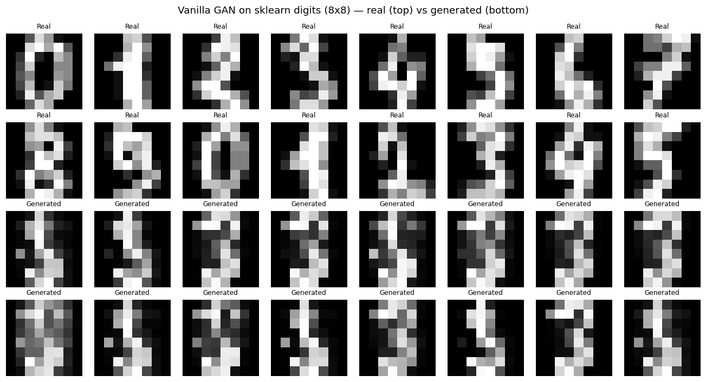<br>
  <em><b>Fig. G.1</b> — Rendered from the trained checkpoint. Top two rows: real digits. Bottom two
  rows: 16 samples from 16 independent noise vectors. This is a textbook <b>mode collapse</b>:
  every sample is a variation on the same vertical-stroke blob, and the diversity of the input
  noise is not reflected in the output. The generator found one region of the data manifold that
  reliably fools the discriminator and stopped exploring — the failure mode that motivated
  Wasserstein GANs, minibatch discrimination, and unrolled GANs.</em>
</p>

### RBM — [`RBM/RBM.py`](RBM/RBM.py)

A Restricted Boltzmann Machine implemented in pure NumPy — no autodiff. 64 visible units
(binarised digit pixels at threshold 0.5), 32 hidden units, trained by **contrastive divergence**
with k = 1 Gibbs steps.

<p align="center">
  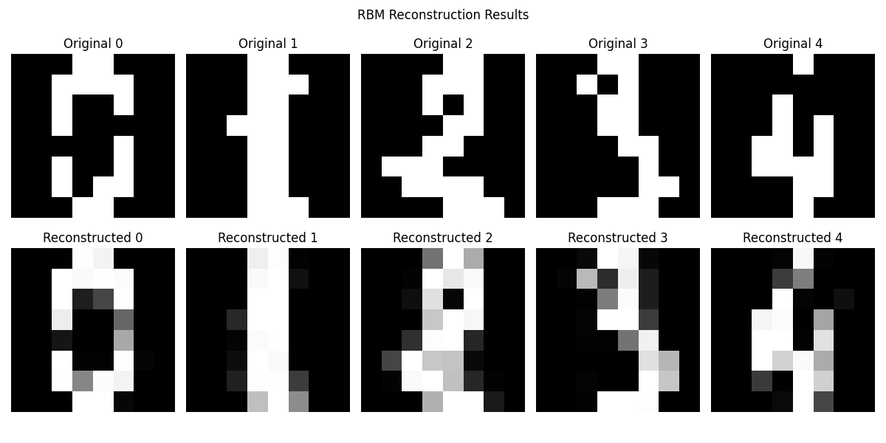<br>
  <em><b>Fig. R.1</b> — Top: binarised inputs. Bottom: reconstructions after one up-down pass.
  The 32-unit bottleneck acts as a lossy compressor — the gross topology of each digit survives,
  the fine strokes do not, and the grey values in the reconstruction are the model's marginal
  probabilities rather than hard samples. CD-1 is a biased approximation of the true gradient, so
  this level of blur is the expected outcome, not a bug.</em>
</p>

---

## Final Project — Symbolic Music Generation

> *[`FinalProject/`](FinalProject/)*

Generating polyphonic piano MIDI with a recurrent language model over musical notes.

### The corpus is synthesised from stock prices, not collected from music

This is the defining design decision of the project and it is easy to miss.
[`Generate_mid/`](FinalProject/MusicGenerator/Generate_mid/) builds the entire 100-file training
pool (`MusicGenerator/pool/*.mid`) procedurally from **Taiwan Stock Exchange weekly closing
prices**:

1. `get_stock.ipynb` pulls two years of daily and weekly data for eight tickers via `yfinance` —
   2888, 2344, 2610, 3481, 2317, 2371, 4562, and 1802 (all `.TW`).
2. `Generate_mid.ipynb` assigns each ticker one degree of a randomly permuted C-major scale
   (MIDI pitches 60, 62, 64, 65, 67, 69, 71, 72). Walking each ticker's weekly series, **every
   week that closes more than 2% above the previous week emits one note** at that ticker's pitch,
   with a duration drawn uniformly from {30, 60, 120, 180, 240} ticks.
3. The resulting note list is then **randomly permuted** (`np.random.permutation`) before being
   written out with `mido`. A new scale permutation is drawn for each of the 100 files.

The consequence matters for reading any result below: because the final shuffle destroys temporal
order, the corpus carries **almost no learnable sequential structure**. What remains is the
marginal distribution over pitches and durations — a unigram statistic. A sequence model trained
on it can learn which notes are common, but there is nothing consistent for its recurrence to
capture, by construction.

### Pipeline

1. **Parse** — `pretty_midi` reads each `.mid` into `Note(start, end, pitch, velocity)` events.
2. **Quantise** — events are binned into a piano-roll at 5 frames/second, giving a
   `{timestep: [pitches]}` dictionary. Simultaneous pitches at one timestep form a chord token.
3. **Tokenise** — a custom `NoteTokenizer` builds a chord-string ↔ index vocabulary, with a
   dedicated `'e'` token for rests.
4. **Model** — `Embedding(vocab, 100)` → `Bidirectional(GRU(128))` → `Dropout(0.3)` →
   `Bidirectional(GRU(128))` → dense → softmax over the vocabulary, trained with sparse categorical
   cross-entropy and Nadam on 5-timestep context windows.
5. **Generate** — autoregressive sampling from either random noise or a seeded first note
   (e.g. middle C = pitch 60), decoded back to `.mid` by inverting the piano-roll.

<p align="center">
  <br>
  <em><b>Fig. F.1</b> — Training loss over ~6,000 steps (20 epochs). The trend is clearly
  downward, from ~85 to ~48, but the per-step variance is enormous and never contracts. Both
  features follow from the corpus described above. The descent is the model learning the marginal
  note distribution, which is genuinely learnable. The variance floor is the part that cannot
  improve: with <code>batch_song = 1</code> every step sees one shuffled file, and since the
  shuffle removed any order information, the conditional entropy given the 5-step context never
  drops below the unconditional entropy. A model that plateaus at the unigram baseline is the
  correct outcome here, not an optimisation failure.</em>
</p>

### Sub-folders

- `MusicGenerator/` — the working implementation, plus two generated samples
  (`example1.mid` from random seed, `example2.mid` seeded on pitch 60).
- `MusicGenerator/Generate_mid/` — the stock-to-MIDI corpus generator and its cached `stock/*.csv`.
- `Test/` — a working copy.
- `example1/`, `example2/` — third-party reference implementations retained for comparison.

#### Provenance of the vendored reference code

These three directories began as clones of public repositories and were then modified locally.
Their nested `.git` directories have been removed, so the upstream history is no longer available
in-tree; the table below records where each came from and the commit it was taken at.

| Directory | Upstream | Commit | Model |
|-----------|----------|--------|-------|
| `example1/` | [xiaohuiduan/lstm-music](https://github.com/xiaohuiduan/lstm-music) | `3bd7770` (2021-02-04) | LSTM over note sequences |
| `example2/` | [cmd23333/MusicGenerator](https://github.com/cmd23333/MusicGenerator) | `c816709` (2020-05-05) | Bi-GRU over piano-roll |
| `Test/` | [cmd23333/MusicGenerator](https://github.com/cmd23333/MusicGenerator) | `c816709` (2020-05-05) | Working copy of the above |

All three carry local edits that diverge from upstream, so they are **not** clean checkouts — diff
against the linked commit before assuming any file is unmodified.

---

## Reference code — [`PDL/`](PDL/)

Vendored source from *Python Deep Learning* (Packt). Kept as a reference implementation set;
not original work.

| Chapter | Contents |
|---------|----------|
| 01–03 | Perceptrons, MLPs, MNIST from first principles |
| 04 | Restricted Boltzmann Machines |
| 05 | Convolutional networks (MNIST, CIFAR, astronomy data) |
| 06 | Character-level language model (`war_and_peace.txt`) |
| 07 | Game playing — minimax, Monte-Carlo, policy gradient, Connect-4, tic-tac-toe |
| 08 | Reinforcement learning — Q-learning, DQN (CartPole, Breakout, Pong), actor-critic |
| 09 | Anomaly detection — ECG pulses, MNIST outlier digits (notebooks with saved figures) |

---

## Setup

The project is managed with [uv](https://github.com/astral-sh/uv) and pinned to Python 3.11:

```bash
uv sync          # creates .venv from pyproject.toml + uv.lock
```

`pyproject.toml` covers the PyTorch-based work (CA0, CA4-2, GAN, RBM). The TensorFlow/Keras
notebooks (CA1, CA2, CA3, CA4-567, FinalProject) were developed on Google Colab and need
`tensorflow`, `tensorflow-hub`, `tensorflow-text`, `transformers`, `datasets`, `pretty_midi`, and
`seaborn` installed separately.

## Data & weights

Datasets and trained weights are **deliberately not tracked** (see [`.gitignore`](.gitignore)) —
they are large, and every one of them is downloadable or regenerable:

| Artifact | Size | How to obtain |
|----------|------|---------------|
| `CA3/imdb_mini.pkl` | 26 MB | First cell of `CA3/Challenge3.ipynb` (`imdb.load_data`) |
| `digit_gan_models.pth` | 1.6 MB | `python GAN/GAN.py` |
| `FinalProject/example1/weights-804-0.01.hdf5` | 29 MB | Retrain, or fetch from the upstream repo |
| `FinalProject/*/model.h5`, `tokenizer.p` | ~3 MB | `Generate_music.ipynb`, "save the model" cell |
| CIFAR-10, IMDB, `aclImdb_v1` | — | Auto-downloaded by `torchvision` / `keras.datasets` / TF Hub |
| `.venv/` | 647 MB | `uv sync` |

`CA3/imdb_mini.pkl` was previously committed and has now been untracked. It still exists in the
repository history, so a `git clone` will still pay for it until history is rewritten
(`git filter-repo` or BFG) — untracking only prevents *future* growth.

## License

[MIT](LICENSE). The `PDL/` and `FinalProject/example*/` directories carry their own upstream
licenses.
